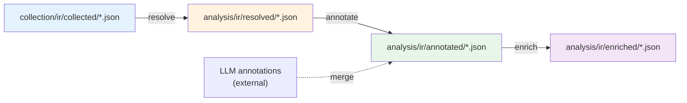
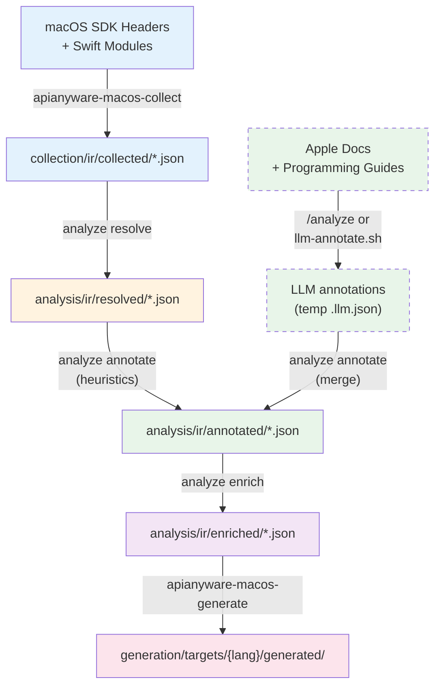

# Annotation Workflow

API annotations classify each ObjC/Swift method with semantic metadata — parameter ownership, block invocation style, threading constraints, and error patterns. These annotations drive the emitter's wrapping decisions and the Datalog verification rules.

## When to run

| Event | What to run | Why |
|---|---|---|
| **First time setup** | Full pipeline: `collect` then `analyze` | Establish baseline annotations |
| **SDK update** (new Xcode/macOS) | Re-run `collect` then `analyze` | New/changed methods need analysis |
| **Adding a new framework** | `collect --only NewFramework` then `analyze --only NewFramework` | Existing frameworks are unaffected |
| **After LLM annotation** | `analyze annotate` then `analyze enrich` | Merge new LLM annotations with heuristics |
| **After editing heuristics** | `analyze annotate` then `analyze enrich` | Re-run heuristics against current IR |
| **Normal development** | Nothing | Annotations are checked in and stable |

## Pipeline Overview



Each step reads checkpoint files from the previous step and writes its own. No in-memory coupling between steps. Each checkpoint is a self-contained JSON file per framework that carries forward all fields from prior steps.

## Step 1: Collection (Rust CLI)

Extract API metadata from macOS SDK headers and Swift modules:

```
apianyware-macos-collect                    # all SDK frameworks
apianyware-macos-collect --only Foundation   # specific framework
apianyware-macos-collect --list              # list available frameworks
```

**Output:** `collection/ir/collected/{Framework}.json` per framework.

**Duration:** ~10 seconds for Foundation (ObjC + Swift merge).

## Step 2: Resolution (Datalog Pass 1)

Flatten inheritance, detect ownership families, resolve protocol conformance:

```
apianyware-macos-analyze resolve
apianyware-macos-analyze resolve --only Foundation
```

**Input:** `collection/ir/collected/*.json`
**Output:** `analysis/ir/resolved/{Framework}.json`

**Duration:** < 1 second for Foundation.

## Step 3: Annotation (Heuristics + LLM Merge)

Run deterministic heuristic classification on every method and merge with any existing LLM annotations:

```
apianyware-macos-analyze annotate
apianyware-macos-analyze annotate --only Foundation
```

**Input:** `analysis/ir/resolved/*.json` + existing `analysis/ir/annotated/{Framework}.json` (if present)
**Output:** `analysis/ir/annotated/{Framework}.json`

**Duration:** < 1 second for Foundation.

### Heuristic classifications

The `annotate` crate applies these rules deterministically:

| Pattern | Detection | Classification |
|---|---|---|
| Block parameters | Selector contains `enumerate`, `sort`, `compare`, `predicate`, `filter` | `synchronous` |
| Block parameters | Selector contains `completion`, `handler`, `callback`, `reply` | `async_copied` |
| Block parameters | Selector contains `observer`, `notification`, `timer` | `stored` |
| Parameter ownership | Parameter named `delegate` or `dataSource` | `weak` |
| Threading | Class is AppKit UI class (NSView, NSWindow, etc.) or selector is `setNeedsDisplay:`, etc. | `main_thread_only` |
| Error pattern | Last param named `error` with pointer-to-pointer type | `error_out_param` |

### API pattern detection

The `annotate` step also detects multi-method behavioral patterns:

| Pattern | Detection signal | Example |
|---|---|---|
| Factory cluster | `NSMutable{X}` / `NS{X}` class pairs | NSMutableArray / NSArray |
| Observer pair | `addObserver:` / `removeObserver:` selector pairs | NSNotificationCenter |
| Paired state | `begin{X}` / `end{X}`, `lock` / `unlock` pairs | NSUndoManager, NSLock |
| Delegate protocol | `setDelegate:` + matching `*Delegate` protocol | NSWindow + NSWindowDelegate |
| Resource lifecycle | `beginAccessing*` / `endAccessing*` pairs | NSBundleResourceRequest |

Patterns are stored in the `api_patterns` field on the Framework checkpoint.

## Step 4: LLM Annotation (External Process)

LLM analysis reads resolved IR + Apple documentation and produces annotations matching the schema. This is NOT part of the Rust pipeline — it's a separate process.

### Option A: Claude Code

```
/analyze
```

The `/analyze` command discovers frameworks with resolved IR and processes them. It reads Apple documentation to classify methods that heuristics can't handle.

### Option B: Script

```
./analysis/scripts/llm-annotate.sh
```

Provider-agnostic script that calls any OpenAI-compatible API (Anthropic, OpenAI, Ollama, vLLM). Configure via `analysis/scripts/config.example.toml`:

```toml
[provider]
url = "https://api.anthropic.com/v1/messages"
model = "claude-sonnet-4-20250514"
api_key_env = "ANTHROPIC_API_KEY"

[paths]
resolved_dir = "analysis/ir/resolved"
annotated_dir = "analysis/ir/annotated"
prompt_template = "analysis/scripts/prompt-template.md"

[options]
batch_size = 20
temperature = 0.0
```

### Option C: Manual editing

Edit `analysis/ir/annotated/{Framework}.json` directly. Set `source: "human_reviewed"` on manually reviewed annotations — these take highest precedence during merge.

### Merge precedence

When the `annotate` step merges annotations:

1. `human_reviewed` — highest priority, never overridden
2. `llm` — LLM-generated, overrides heuristics
3. `heuristic` — deterministic, fills gaps

## Step 5: Enrichment (Datalog Pass 2)

Derive generation-facing relations from annotations + type facts:

```
apianyware-macos-analyze enrich
apianyware-macos-analyze enrich --only Foundation
```

**Input:** `analysis/ir/annotated/*.json`
**Output:** `analysis/ir/enriched/{Framework}.json`

**Duration:** < 1 second for Foundation.

The enriched checkpoint includes a `verification` section. If verification fails, the framework has unclassified block parameters or ownership flag mismatches that must be resolved before generation.

## Full Pipeline

Run all steps sequentially with a single command:

```
apianyware-macos-analyze                      # resolve -> annotate -> enrich
apianyware-macos-analyze --only Foundation     # single framework
```

## How the pieces connect



## Overrides

If heuristic and LLM annotations disagree on a method, the `annotate` step's `validate` module detects the disagreement and resolves it (LLM wins by default). To override manually, edit the annotated checkpoint directly and set `source: "human_reviewed"`.

## Checking annotation coverage

After running the pipeline, check the enriched checkpoint's verification section:

```bash
# Check if verification passed
jq '.verification.passed' analysis/ir/enriched/Foundation.json

# List any violations
jq '.verification.violations' analysis/ir/enriched/Foundation.json

# Count annotated methods
jq '.class_annotations | map(.methods | length) | add' analysis/ir/annotated/Foundation.json
```

A verification failure means there are unclassified block parameters or ownership mismatches that need LLM annotation or manual review.
