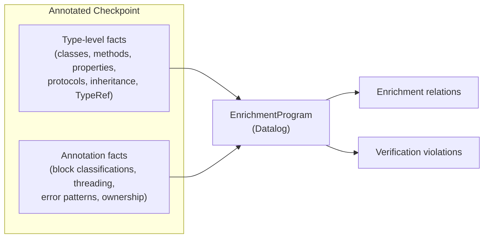

# Enrichment Rules

This document defines every derived relation and verification rule in the enrichment Datalog program (`analysis/crates/enrich/src/program.rs`). Emitters read these relations from the `enrichment` section of the enriched checkpoint to make wrapping decisions.

**Source code:** `analysis/crates/enrich/src/program.rs`
**Fact loading:** `analysis/crates/enrich/src/fact_loader.rs`
**Checkpoint building:** `analysis/crates/enrich/src/checkpoint.rs`

## Input: Two Fact Sources

The enrichment program loads facts from a single annotated checkpoint file, which contains data from two conceptual sources:



| Fact source | What it provides | Loaded from |
|---|---|---|
| **Type-level** | `class_decl`, `inherits_from`, `conforms_to`, `method_decl`, `property_decl`, `protocol_decl`, `protocol_method`, `has_block_param`, `method_returns_object`, `returns_retained_from_resolve`, `resolve_processed_method` | Framework IR fields (classes, methods, protocols, TypeRef analysis) |
| **Annotation** | `block_is_synchronous`, `block_is_async_copied`, `block_is_stored`, `main_thread_only`, `method_has_error_outparam`, `weak_param` | `class_annotations` on the Framework |

## Derived Relations (Enrichment)

### `sync_block_method(class, selector, param_index)`

**Meaning:** Block parameter at `param_index` on `class.selector` is invoked synchronously. The Cocoa API calls the block inline and does NOT `Block_copy` it.

**Derived from:** `block_is_synchronous` annotation fact (direct lift).

**Emitter action:** Generate code that explicitly frees the block after the API call returns. Without explicit free, the block leaks because the dispose helper never fires.

**Foundation examples:** `NSArray.enumerateObjectsUsingBlock:` (param 0), `NSDictionary.enumerateKeysAndObjectsUsingBlock:` (param 0).

### `async_block_method(class, selector, param_index)`

**Meaning:** Block parameter at `param_index` on `class.selector` is copied by Cocoa for asynchronous invocation. The ObjC runtime manages the block's lifecycle via `Block_copy`/`Block_release`.

**Derived from:** `block_is_async_copied` annotation fact (direct lift).

**Emitter action:** No explicit free needed. The Swift dylib's copy/dispose helpers handle lifecycle automatically. The language-side GC prevention handle is released when the block's dispose helper fires.

**Foundation examples:** `NSURLSession.dataTaskWithRequest:completionHandler:` (param 1), `NSOperationQueue.addOperationWithBlock:` (param 0).

### `stored_block_method(class, selector, param_index)`

**Meaning:** Block parameter at `param_index` on `class.selector` is retained for repeated invocation (observer, timer, notification handler). The block lives until explicitly removed.

**Derived from:** `block_is_stored` annotation fact (direct lift).

**Emitter action:** The block must remain alive until the observer/timer is removed. Emitters should generate paired register/unregister patterns (often detected as `observer_pair` API patterns). The language runtime must hold a strong reference to the block for the observer's lifetime.

**Foundation examples:** `NSNotificationCenter.addObserverForName:object:queue:usingBlock:` (param 3).

### `convenience_error_method(class, selector)`

**Meaning:** Method has an `NSError**` out-parameter (the Cocoa error-out pattern). The method returns a success indicator and writes an error object to the out-param on failure.

**Derived from:** `method_has_error_outparam` annotation fact (direct lift).

**Emitter action:** Generate a `Result`/`Either`-style wrapper. Instead of exposing the raw `NSError**` parameter, the emitter wraps the call: invoke the method, check the return value, and return either the result or the error as a language-idiomatic type.

**Foundation examples:** `NSFileManager.contentsOfDirectoryAtPath:error:`, `NSJSONSerialization.JSONObjectWithData:options:error:`.

### `collection_iterable(class)`

**Meaning:** Class supports indexed iteration — it has `objectAtIndex:` + `count`, or conforms to `NSFastEnumeration`.

**Derived from:** Two rules:
1. `has_indexed_access(class)` (has `objectAtIndex:` instance method) AND `has_count_property(class)` (has `count` property)
2. `conforms_to(class, "NSFastEnumeration")`

**Emitter action:** Generate iteration support (for-each, map, fold, lazy sequence). The emitter produces both indexed access and fast enumeration wrappers where available.

**Foundation examples:** NSArray, NSDictionary, NSSet, NSOrderedSet, NSPointerArray, NSHashTable, NSMapTable, NSEnumerator, NSOrderedCollectionDifference.

### `delegate_protocol(protocol_name)`

**Meaning:** Protocol is a delegate or data source protocol. A class has `setDelegate:` (or `setDataSource:`) and conforms to a protocol ending in `Delegate` (or `DataSource`).

**Derived from:** Two rules:
1. `method_decl(class, "setDelegate:", false, _)` AND `conforms_to(class, protocol)` where `protocol` ends with `"Delegate"`
2. `method_decl(class, "setDataSource:", false, _)` AND `conforms_to(class, protocol)` where `protocol` ends with `"DataSource"`

Also supplemented by `DelegateProtocol` API patterns detected by heuristics or LLM.

**Emitter action:** Generate a typed delegate builder that creates dynamic ObjC delegate objects with IMP trampolines dispatching to language-side callbacks. The builder exposes only the protocol's methods, with typed signatures.

**Foundation examples:** Foundation has no delegate protocols (they are in AppKit). Expected in AppKit: `NSWindowDelegate`, `NSTableViewDelegate`, `NSTextFieldDelegate`.

### `main_thread_class(class)`

**Meaning:** At least one method on this class has a `MainThreadOnly` threading annotation. The entire class should be treated as main-thread-only.

**Derived from:** `main_thread_only(class, _any_selector)` — if any method on the class is main-thread-only, the class itself is flagged.

**Emitter action:** Generate a main-thread assertion or dispatch wrapper. Calls to methods on these classes should either assert they're on the main thread or automatically dispatch to the main thread.

**Foundation examples:** Foundation has no main-thread classes. Expected in AppKit: `NSView`, `NSWindow`, `NSApplication`.

### Scoped resources (from API patterns)

**Meaning:** Class has a paired open/close lifecycle detected from `PairedState` or `ResourceLifecycle` API patterns.

**Not a Datalog relation** — extracted directly from `api_patterns` by the checkpoint builder. Looks for `open`/`close`, `begin`/`end`, `lock`/`unlock`, or `enable`/`disable` participant pairs.

**Emitter action:** Generate `with-*` bracket forms, RAII guards, or scoped helpers that guarantee the close/end/unlock is called even if an exception occurs.

**Foundation examples:** `NSLock` (lock/unlock), `NSUndoManager` (beginUndoGrouping/endUndoGrouping), `NSMutableAttributedString` (beginEditing/endEditing), `NSBundleResourceRequest` (beginAccessingResources/endAccessingResources).

## Verification Rules

Verification rules detect inconsistencies that indicate missing annotations or resolve/naming disagreements. A non-empty violation set means the framework needs attention before generation.

### `violation_unclassified_block(class, selector, param_index)`

**Meaning:** A method has a block-typed parameter (detected from `TypeRef`) but no block invocation classification (sync/async/stored) from annotations.

**Detection:** `has_block_param(class, sel, idx)` AND NOT `block_classified(class, sel, idx)`, where `block_classified` is the union of all three block classification facts.

**Fix:** Add LLM or manual annotation for the unclassified block parameter. The heuristic classifier handles most cases, but some methods have ambiguous names.

### `violation_flag_mismatch(class, selector)`

**Meaning:** The `returns_retained` flag from the resolve step disagrees with what the ownership naming convention predicts.

**Detection:** Two directions:
1. Resolve says retained, but naming convention says not retained
2. Naming convention says retained, resolve says not retained (only checked for `resolve_processed_method` — methods that the resolve step actually processed, to avoid false positives on category methods)

**Fix:** Investigate the method. Usually indicates a method that doesn't follow naming conventions (e.g., a factory method not in the `new` family that returns +1). May need an annotation override.

## Enriched Checkpoint Structure

The enrichment data is written to the `enrichment` field on the Framework:

```json
{
  "enrichment": {
    "sync_block_methods": [
      { "class": "NSArray", "selector": "enumerateObjectsUsingBlock:", "param_index": 0 }
    ],
    "async_block_methods": [...],
    "stored_block_methods": [...],
    "delegate_protocols": ["NSWindowDelegate"],
    "convenience_error_methods": [
      { "class": "NSFileManager", "selector": "contentsOfDirectoryAtPath:error:" }
    ],
    "collection_iterables": ["NSArray", "NSSet", "NSOrderedSet"],
    "scoped_resources": [
      { "class": "NSLock", "open_selector": "lock", "close_selector": "unlock" }
    ],
    "main_thread_classes": ["NSView", "NSWindow"]
  },
  "verification": {
    "passed": true,
    "violations": []
  }
}
```

Fields with empty arrays are omitted from serialization (via `skip_serializing_if`).

## Foundation Numbers (Current SDK)

| Relation | Count | Notes |
|---|---|---|
| `sync_block_methods` | 81 | Enumeration, sorting, comparison blocks |
| `async_block_methods` | 116 | Completion handlers, async callbacks |
| `stored_block_methods` | 4 | Observer/notification handlers |
| `delegate_protocols` | 0 | Foundation doesn't use setDelegate: (AppKit does) |
| `convenience_error_methods` | 199 | NSError** out-param methods |
| `collection_iterables` | 10 | NSArray, NSDictionary, NSSet, + 7 others |
| `scoped_resources` | 4 | NSLock, NSUndoManager, NSMutableAttributedString, NSBundleResourceRequest |
| `main_thread_classes` | 0 | Foundation is thread-safe (AppKit has these) |
| Verification violations | 0 | All block params classified, all flags consistent |
