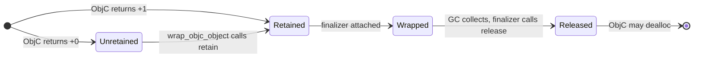
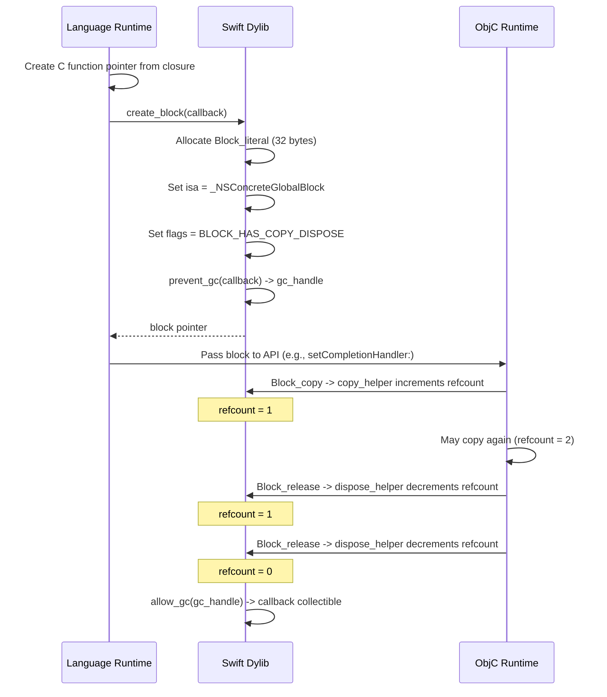
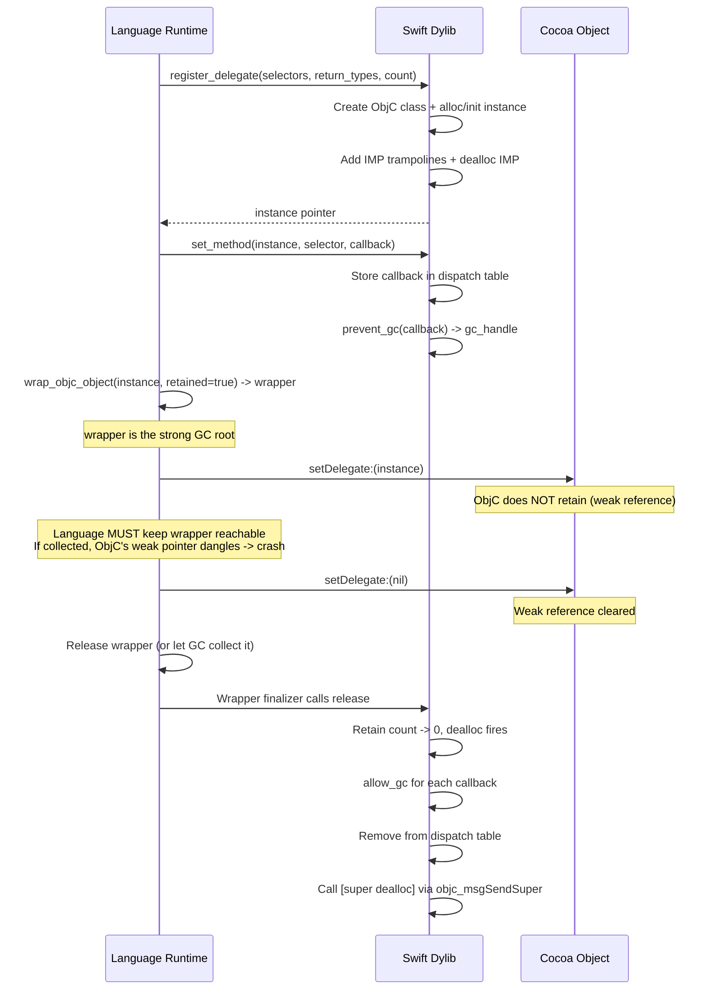

# Memory Architecture

This document defines the memory management model that all APIAnyware language projections must implement. It is the authoritative reference for how ObjC reference counting maps to garbage-collected languages, how callback lifetimes are managed bidirectionally, and how the Swift helper dylib participates in the ownership model.

**Audience:** Developers implementing or maintaining a language projection (Racket, Chez Scheme, Gerbil Scheme, Common Lisp, Haskell, OCaml, Zig, or other targets). This document is language-independent. For language-specific implementation details, see the per-language docs in `generation/docs/`.

**Companion documents:**
- `annotation-workflow.md` — how to run the annotation pipeline (LLM analysis + heuristic merge)
- `enrich-rules.md` — what each enrichment-derived relation means and how emitters use it
- `api-pattern-catalog.md` — multi-method behavioral contracts and their idiomatic translations

---

## 1. ObjC Reference Counting Fundamentals

ObjC objects are reference-counted. Every object has a retain count. When it reaches zero, the object is deallocated. Three operations control the count:

| Operation | Effect | When used |
|---|---|---|
| `retain` | +1 | Taking ownership of an object |
| `release` | -1 | Releasing ownership; object deallocated if count hits 0 |
| `autorelease` | Deferred -1 | Schedules a `release` when the current autorelease pool drains |

These are not guidelines — they are ABI contracts enforced by the ObjC runtime. Violating them causes use-after-free crashes or memory leaks.

### 1.1 Ownership Conventions

ObjC methods follow naming conventions that determine whether the caller owns the returned object:

| Method family | Convention | Caller owns? | What the caller must do |
|---|---|---|---|
| `init...` (instance) | Returns +1 | Yes | Must eventually release |
| `new...` (class) | Returns +1 | Yes | Must eventually release |
| `copy...` | Returns +1 | Yes | Must eventually release |
| `mutableCopy...` | Returns +1 | Yes | Must eventually release |
| `alloc` (class) | Returns +1 | Yes | Always paired with `init`; never emitted standalone |
| Everything else | Returns +0 (autoreleased) | No | Valid only until the current autorelease pool drains |

**Family matching rules:** A selector belongs to a family if it equals the family name exactly (e.g., `init`, `copy`), OR starts with the family name followed by an uppercase letter, colon, or (for Swift-style selectors) opening parenthesis (e.g., `initWithString:`, `copyWithZone:`, `init(arrayLiteral:)`).

Examples:
- `initWithUTF8String:` — **init family** (+1)
- `initialize` — **NOT init family** (lowercase letter follows "init") — (+0)
- `copyWithZone:` — **copy family** (+1)
- `description` — **no family** (+0)
- `newMessageWithString:` — **new family** (+1)
- `init(arrayLiteral:)` — **init family** (+1, Swift-style selector)

The `resolve` analysis step detects these families via the `is_returns_retained` function and stores the result in the `returns_retained` field on each method in the resolved IR checkpoint.

### 1.2 Nil Returns

Methods returning `id` can return `nil` (e.g., `objectForKey:` when the key is absent). The wrapping function must handle this:

- If the raw pointer is null/nil: return the language's null ObjC object sentinel (e.g., `objc-null`)
- Do NOT call `retain` on a nil pointer
- The null sentinel must not have a release finalizer attached

### 1.3 Autorelease Pools

Autoreleased objects are placed in the innermost autorelease pool on the current thread. When the pool drains (via `objc_autoreleasePoolPop`), all objects autoreleased since the matching `objc_autoreleasePoolPush` receive a `release` message.

Key rules:
- **Every thread** that calls ObjC code must have an autorelease pool
- The main thread's pool is managed by `NSApplication`'s run loop (one pool per event iteration)
- Without a pool, autoreleased objects leak with console warnings ("Object autoreleased with no pool in place")
- Pools nest: inner pools drain independently of outer pools

### 1.4 macOS-Specific Considerations

- **arm64e pointer authentication (PAC):** Function pointers passed to ObjC must be correctly signed. The Swift dylib handles this transparently — language runtimes must never construct raw function pointers for direct use as IMPs or block invoke functions. Always go through the dylib's `create_block` and `register_delegate` APIs.
- **Swift runtime dependency:** The dylib links `libswiftCore.dylib` and `libswiftObservation.dylib`, both shipped with macOS 14+. No additional Swift installation is needed.
- **Thread safety:** ObjC runtime functions (`objc_msgSend`, `retain`, `release`) are thread-safe. The Swift dylib's mutable state (dispatch tables, GC registry, block refcounts) is protected by `os_unfair_lock`.

---

## 2. The Ownership Model

### 2.1 Principle

Every value crossing the FFI boundary has exactly one owner. Ownership transfer is explicit. Borrowing has a defined validity scope.

### 2.2 ObjC to Language: Objects

**All ObjC objects returned to the language runtime are wrapped with a release finalizer.**

The wrapping function (called `wrap-objc-object` or equivalent in each language) is the single point of ownership transfer:

```
wrap_objc_object(raw_pointer, already_retained) -> wrapped_object
```

The `already_retained` parameter (a boolean) determines behavior:

| `already_retained` | Meaning | What `wrap_objc_object` does |
|---|---|---|
| `true` | Method returned +1 (init/copy/new/mutableCopy) | Wraps directly. The finalizer's `release` balances the +1. |
| `false` | Method returned +0 (autoreleased) | Calls `retain` first, then wraps. The finalizer's `release` balances the retain. |

When the language's garbage collector determines the wrapped object is unreachable, the finalizer calls `release`, decrementing the ObjC retain count. If this was the last reference, ObjC deallocates the object.

**Critical safety property:** The `retain` in `wrap_objc_object` happens immediately (same thread, sequential code), before the function returns. This means the object is safe from autorelease pool drainage — it has at least +1 from the wrapper regardless of when pools drain.

The following diagram shows the ownership state machine:



### 2.3 Language to ObjC: Blocks

ObjC blocks are callable objects that Cocoa APIs accept as callbacks. Language projections create blocks by wrapping language closures in the ObjC block ABI via the Swift dylib.

#### Block ABI Structure

The block struct is 32 bytes:

```
Block_literal (32 bytes):
  void*   isa            // -> _NSConcreteGlobalBlock (8 bytes)
  int32   flags          // BLOCK_HAS_COPY_DISPOSE = 1 << 25 (4 bytes)
  int32   reserved       // 0 (4 bytes)
  void*   invoke         // C function pointer (8 bytes)
  void*   descriptor     // -> Block_descriptor (8 bytes)
```

The descriptor includes copy/dispose helpers:

```
Block_descriptor (32 bytes):
  uint64  reserved       // 0 (8 bytes)
  uint64  size           // 32 = sizeof(Block_literal) (8 bytes)
  void*   copy_helper    // -> block_copy_helper (8 bytes)
  void*   dispose_helper // -> block_dispose_helper (8 bytes)
```

#### Why `_NSConcreteGlobalBlock`

The block's `isa` must be `_NSConcreteGlobalBlock`, not `_NSConcreteStackBlock`. Our blocks are heap-allocated with no captured state — the invoke function pointer is stored in the struct field, not captured. Using `_NSConcreteStackBlock` causes `Block_copy` to memcpy the block to a new location and invalidate the original pointer, leading to use-after-free crashes. `_NSConcreteGlobalBlock` tells the runtime the block is stable and `Block_copy` returns the same pointer.

#### Block Lifecycle with Copy/Dispose

The `BLOCK_HAS_COPY_DISPOSE` flag (bit 25) tells the ObjC runtime to call copy and dispose helpers during the block's lifetime. The dylib maintains an internal reference count per block (stored in a lock-protected dictionary, separate from the block struct):



When the refcount reaches zero, the dispose helper calls `allow_gc` to release the GC prevention handle, making the language-side callback closure eligible for garbage collection.

#### Block Lifecycle Categories

The enrichment step classifies every block parameter into one of three categories (see `enrich-rules.md` for details):

| Category | Enrichment relation | Lifecycle | Emitter action |
|---|---|---|---|
| **Synchronous** | `sync_block_method` | Invoked inline, never `Block_copy`'d | Caller must explicitly free after call returns |
| **Async/Copied** | `async_block_method` | `Block_copy`'d by Cocoa, auto-released | No explicit free needed; dispose helper handles it |
| **Stored** | `stored_block_method` | Retained for repeated invocation | Observer/timer pattern; lives until explicitly removed |

#### Synchronous-Only Block APIs (Escape Hatch)

Some Cocoa APIs invoke blocks synchronously and do NOT call `Block_copy`. Since no copy occurs, the refcount never increments, and the dispose helper never fires. For these APIs, the user must free the block explicitly after the call returns.

Known synchronous-only block APIs (detected by heuristics and confirmed by LLM analysis):

**Foundation:**
| Class | Selector | Notes |
|---|---|---|
| `NSArray` | `enumerateObjectsUsingBlock:` | Invokes block for each element, returns when done |
| `NSArray` | `sortedArrayUsingComparator:` | Invokes comparator during sort |
| `NSDictionary` | `enumerateKeysAndObjectsUsingBlock:` | Synchronous enumeration |
| `NSSet` | `enumerateObjectsUsingBlock:` | Synchronous enumeration |
| `NSString` | `enumerateSubstringsInRange:options:usingBlock:` | Synchronous enumeration |
| `NSIndexSet` | `enumerateIndexesUsingBlock:` | Synchronous enumeration |

**General heuristic:** Methods containing `enumerate`, `sort`, `compare`, `predicate`, or `filter` in their name and accepting a block typically invoke it synchronously. Methods containing `completion`, `handler`, `callback`, or `reply` typically copy the block for async use. The enrichment Datalog engine encodes this via `sync_block_method` / `async_block_method` derived relations.

### 2.4 Language to ObjC: Delegates

Delegates are ObjC objects whose methods dispatch to language-side callback closures. The Swift dylib creates dynamic ObjC classes at runtime with IMP trampolines that look up and invoke registered callbacks.

#### The Weak Reference Problem

**Critical Cocoa convention:** Delegate properties (`NSWindow.delegate`, `NSTableView.delegate`, etc.) are almost universally declared `weak` or `assign`. The owning Cocoa object does **not** retain its delegate. This is a deliberate Cocoa design to avoid retain cycles.

This means the delegate lifecycle is **language-controlled**, not ObjC-controlled:

- The language runtime must hold a **strong GC root** to the delegate for as long as it is set on an owner
- If the language GC collects the delegate while the owner still holds a (weak) reference to it, the result is a dangling pointer and a crash
- The `dealloc` IMP (see below) is a **defense-in-depth** cleanup mechanism, not the primary lifecycle mechanism

The enrichment step detects delegate protocols via the `delegate_protocol` relation (see `enrich-rules.md`).

#### Delegate Lifecycle



#### Dealloc IMP (Defense-in-Depth)

Each dynamically created delegate class has a `dealloc` IMP registered via `class_addMethod`. When the delegate's retain count reaches zero:

1. Acquires `delegateLock`
2. Retrieves and removes the instance's dispatch table entry
3. Calls `allow_gc` for every registered callback on that instance
4. Releases `delegateLock`
5. Calls `objc_msgSendSuper(self, "dealloc")` to invoke NSObject's dealloc

#### Delegate Dispatch Model

The dylib provides 12 pre-built IMP trampolines covering the common delegate method signatures:

| Return type | 0 args | 1 arg | 2 args | 3 args |
|---|---|---|---|---|
| `void` | `impVoid0` | `impVoid1` | `impVoid2` | `impVoid3` |
| `bool` | `impBool0` | `impBool1` | `impBool2` | `impBool3` |
| `id` | `impId0` | `impId1` | `impId2` | `impId3` |

Each trampoline:
1. Receives `(self, _cmd, arg0?, arg1?, arg2?)` from ObjC
2. Looks up the callback in the dispatch table using `(self_pointer, selector_name)` as the key
3. Calls the callback with just the method arguments (self and _cmd are stripped)
4. Returns a default value (void/false/nil) if no callback is registered

### 2.5 Value Types: Strings and Structs

**Value types are always copied across the FFI boundary. No shared ownership.**

#### Strings

| Direction | Function | Semantics |
|---|---|---|
| Language -> NSString | `aw_common_string_to_nsstring(utf8)` | Creates a new NSString (+1). The language wraps it like any other object. |
| NSString -> Language | `aw_common_nsstring_to_string(nsstring)` | Returns a borrowed `const char*` valid until the NSString is released or the autorelease pool drains. |

**Critical:** The `const char*` from `nsstring_to_string` is a borrowed pointer. The language runtime must copy it immediately into a language-owned string. The borrowed pointer must not escape the call scope.

#### Structs

Five struct types are supported: `CGRect`, `CGSize`, `CGPoint`, `NSRange`, `NSEdgeInsets`.

| Function | Purpose |
|---|---|
| `aw_common_pack_{type}(fields..., buffer)` | Writes struct bytes into the provided buffer |
| `aw_common_unpack_{type}(buffer)` | Reads struct fields from raw bytes |
| `aw_common_sizeof_{type}()` | Returns the struct size in bytes |

Each side owns its own copy. No aliasing, no lifetime concerns.

---

## 3. Autorelease Pool Management

### 3.1 Strategy

Generated bindings do NOT manage autorelease pools. Pool management is the application's responsibility. The runtime provides helpers, but the application decides when and where to use them.

### 3.2 Three Scenarios

#### GUI Applications

The Cocoa run loop (`NSApplication.run()`) pushes and drains a pool on each event iteration. No user action required. All ObjC calls within an event handler are covered by this pool.

#### Scripts and CLI Tools

The user must wrap their top-level code in an autorelease pool:

```
with-autorelease-pool:
    do-objc-stuff()
```

Without this, autoreleased temporaries accumulate until process exit. This is a bounded leak (proportional to the number of ObjC method calls), not a crash. It produces console warnings. The per-language documentation must state this clearly.

#### Background Threads

Every thread that calls ObjC must have its own autorelease pool. Each language runtime provides two helpers:

| Helper | Purpose |
|---|---|
| `objc-thread(body)` | Spawns a thread with an autorelease pool that drains when `body` returns |
| `with-objc-pool-guard(callback)` | Wraps a callback so every invocation pushes/pops a pool |

These helpers ensure users never accidentally call ObjC from a bare thread.

### 3.3 Safety Guarantee

The `wrap_objc_object` function retains the object immediately, before returning. This means wrapped objects survive autorelease pool drainage. The pool determines when autoreleased *temporaries* are freed, but wrapped objects are independent of pool scope. Once an object is wrapped, it lives until the wrapper is garbage-collected.

---

## 4. The Abstract Runtime Contract

Every language projection must implement this interface. The emitters generate code against it.

### 4.1 Required Functions

| Function | Signature (pseudocode) | Purpose |
|---|---|---|
| `wrap-objc-object` | `(ptr, retained?) -> wrapped` | Wrap raw pointer with release finalizer. Retains if not already retained. Returns null sentinel if ptr is nil. |
| `unwrap-objc-object` | `(wrapped) -> ptr` | Extract raw pointer for passing to ObjC. No ref count change. |
| `coerce-arg` | `(value) -> ptr` | Convert language value to ObjC-compatible form. Strings -> NSString (+1, wrapped). Objects -> unwrapped ptr. |
| `with-autorelease-pool` | `(body) -> result` | Push/pop autorelease pool around body execution. |
| `objc-thread` | `(body) -> thread` | Spawn thread with autorelease pool. |
| `with-objc-pool-guard` | `(callback) -> guarded-callback` | Wrap callback to push/pop pool on each invocation. |
| `objc-object?` | `(value) -> bool` | Predicate: is this a wrapped ObjC object? |
| `objc-null?` | `(value) -> bool` | Predicate: is this the nil/null ObjC sentinel? |

### 4.2 Emitter Code Generation Contract

The emitter generates code that calls the runtime contract functions. The emitter's responsibility is to determine the `retained?` flag using the `returns_retained` field from the enriched IR:

```
;; Constructor (init family, +1)
(define (make-foo-with-bar bar)
  (wrap-objc-object
    (msgSend (msgSend FooClass "alloc") "initWithBar:" (coerce-arg bar))
    #:retained #t))

;; Regular method returning object (+0)
(define (foo-some-method self)
  (wrap-objc-object
    (msgSend (coerce-arg self) "someMethod")))

;; Copy method (+1)
(define (foo-copy self)
  (wrap-objc-object
    (msgSend (coerce-arg self) "copy")
    #:retained #t))

;; Method returning primitive (no wrapping)
(define (foo-count self)
  (msgSend-uint (coerce-arg self) "count"))
```

The rule is simple and exhaustive: **every method that returns an ObjC object type (`id`, `instancetype`, class type) must be wrapped**. The `retained?` flag comes from the enriched IR's `returns_retained` field (computed by the resolve step).

---

## 5. GC Prevention: Dual Mechanism

When a language runtime creates a C function pointer from a closure (for use as a block invoke or delegate callback), two separate systems must prevent the backing memory from being collected:

### 5.1 Language-Side Strong Reference

The language runtime stores the C function pointer (and the original closure) in a data structure that prevents the GC from collecting them. This is language-specific:

- **Racket:** `active-blocks` hash table (blocks), `swift-gc-handles` hash table (delegates)
- **Chez:** A global table or guardian-protected reference
- **Gerbil:** A will-executor protected reference

### 5.2 Swift-Side Registry

The dylib's GC prevention registry (`aw_{lang}_prevent_gc` / `aw_{lang}_allow_gc`) stores the raw pointer value in a Swift-side dictionary. This serves as an independent safety net.

### 5.3 Why Both Are Needed

| Mechanism | What it prevents | What it doesn't prevent |
|---|---|---|
| Language-side reference | Language GC from collecting the closure | Nothing — but only works if the runtime correctly maintains the reference |
| Swift-side registry | Collection even if language-side reference is accidentally dropped | Nothing — but only works if `prevent_gc` was called |

The dual mechanism provides defense-in-depth.

---

## 6. Datalog Verification

The analysis pipeline uses Datalog (via the `ascent` crate) to verify that ownership invariants hold for every method across every framework. This is **exhaustive property checking over the entire API surface**, not sample-based testing.

### 6.1 Verification Rules

| Rule | What it checks | Non-empty means |
|---|---|---|
| `violation_flag_mismatch` | `retained?` flag matches ownership convention | Double-retain or use-after-free |
| `violation_unclassified_block` | Every block parameter is classified sync/async/stored | Unknown block lifecycle |

### 6.2 Verification Layers

| Layer | Formalism | Scope | When |
|---|---|---|---|
| **API surface (Datalog)** | Rules over facts | Every method in every framework | After enrichment, before generation |
| **Runtime assertions** | Debug-mode checks | Individual calls | At runtime in debug builds |
| **Cross-language parity** | Equivalence tests | Same test in all languages | CI test suite |

The Datalog layer is the most powerful because it is exhaustive — it checks every method in Foundation and AppKit, not just methods with handwritten tests.

---

## 7. Summary of Ownership Rules

These rules are the complete, non-redundant set of invariants. A correct language projection satisfies all of them.

1. **Every ObjC object returned across the FFI is wrapped with a release finalizer.** No exceptions.
2. **`wrap_objc_object` retains +0 objects immediately.** The object is safe from pool drainage before the function returns.
3. **`wrap_objc_object` does not retain +1 objects.** The existing +1 is consumed by the finalizer.
4. **Nil pointers become the null sentinel.** No retain, no finalizer.
5. **Blocks use `_NSConcreteGlobalBlock` and `BLOCK_HAS_COPY_DISPOSE`.** The ObjC runtime manages the copy/release lifecycle.
6. **Delegate strong references are language-controlled.** Cocoa does not retain delegates; the language must keep them alive.
7. **`dealloc` on delegates is defense-in-depth.** It cleans up callbacks, but the language is responsible for the primary lifecycle.
8. **Value types (strings, structs) are always copied.** No shared ownership, no lifetime concerns.
9. **Every callback has dual GC prevention.** Language-side strong reference + Swift-side registry.
10. **Synchronous-only block APIs require explicit free.** The dispose helper does not fire without `Block_copy`.
11. **Every thread that calls ObjC must have an autorelease pool.** Use `objc-thread` or `with-objc-pool-guard`.
