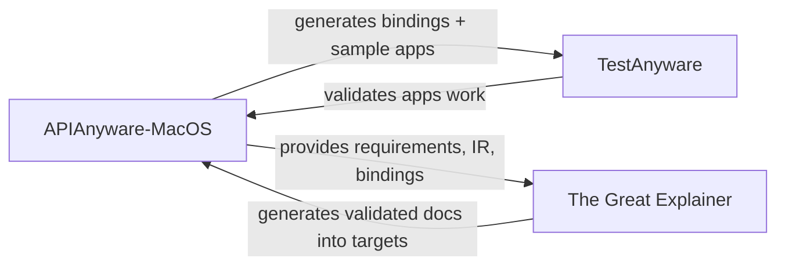

# Plan Restructure: Language Targets, Testing & Documentation

**Date:** 2026-03-27
**Status:** Approved
**Supersedes:** Milestone 7.3–7.14 of the original plan (single milestone for all languages)

## Purpose

Restructure the APIAnyware-MacOS implementation plan to give each target language its own milestone with comprehensive substeps for emitter development, testing, sample apps, and documentation. Establish a parameterized template so the workflow is repeatable and consistent across all language targets (12 languages grouped into 11 milestones — Prolog and Mercury share an emitter).

## Context

Milestones 1–7.2 are complete: the full Collection → Analysis pipeline works, the shared emitter framework and Swift helper dylibs are built, and the Racket emitter crate + runtime have been ported from the POC. What remains is:

- Completing the Racket target (testing, sample apps, validation)
- Building 10 additional language targets
- Establishing test infrastructure that works across all targets
- Producing documentation for each target

The original plan had all 12 language targets as single line items under one milestone. The actual work per language is 11+ substeps spanning emitter code, runtime libraries, sample apps, GUI testing, and documentation — far too much for a single line item.

## Three-Product Ecosystem

APIAnyware-MacOS operates within a three-product ecosystem:



- **APIAnyware-MacOS** — extracts, analyzes, and generates idiomatic language bindings for macOS APIs
- **TestAnyware** — screenshot-driven GUI testing in a macOS VM, designed for LLM-automated QA
- **The Great Explainer** — general-purpose documentation, instructional design, and tutorial validation product (new, driven initially by our requirements)

## Milestone Structure

### Completed (unchanged)

| Milestone | Content |
|-----------|---------|
| 1 | Shared Types |
| 2 | ObjC/C Collection |
| 3 | Swift Collection |
| 4 | Datalog Resolution |
| 5 | Annotation & API Pattern Recognition |
| 6 | Enrichment |
| 7 | Shared Emitter Framework + Swift Dylibs (7.1–7.2) |

### New Milestones

| Milestone | Content | Dependencies |
|-----------|---------|--------------|
| 8 | **Test Infrastructure & Workflow** | 7 |
| 9 | **Racket** (OO + Functional) — steps 9.1-9.2 done from Milestone 7.3 | 8 |
| 10 | **Chez Scheme** (Functional) | 8 |
| 11 | **Gerbil Scheme** (OO + Functional) | 8 |
| 12 | **Haskell** (Monadic + Lens-based) | 8 |
| 13 | **OCaml** (Modules + OO) | 8 |
| 14 | **Prolog/Mercury** (Relational) | 8 |
| 15 | **Idris2** (Dependently-typed) | 8 |
| 16 | **Common Lisp** (CLOS + Functional; SBCL and CCL) | 8 |
| 17 | **Rhombus** (OO) | 8 |
| 18 | **Pharo Smalltalk** (Message-passing OO) | 8 |
| 19 | **Zig** (Procedural) | 8 |
| 20 | **The Great Explainer — Requirements** | None |
| 21 | **Documentation Pass** | 20, 9–19 |

**Language ordering rationale:** Maximizes paradigm diversity early. Scheme family first (reuses infrastructure), then monadic (Haskell), modules (OCaml), relational (Prolog/Mercury), dependent types (Idris2), CLOS (CL), then the remaining unique paradigms.

## Milestone 8: Test Infrastructure & Workflow

Built before any language target completes. Provides the machinery every language uses.

| Step | Name | Description |
|------|------|-------------|
| 8.1 | Generation CLI | `apianyware-macos-generate` binary. `--lang` flag selects a language (default: all). Discovers enriched IR, invokes the registered emitter, writes to `generation/targets/{lang}/generated/`. Generates all frameworks and all binding styles for the selected language. |
| 8.2 | Snapshot test harness | Framework for golden-file regression tests. Generate bindings, diff against checked-in reference files. Per-language, per-binding-style golden sets. Integrated into `cargo test`. |
| 8.3 | Sample app specifications | Language-independent specs for the 8 standard sample apps. Each spec defines: window layout, controls, interactions, expected behaviors. The spec is the contract — implementations must match it. |
| 8.4 | TestAnyware workflow | Document the LLM-driven QA workflow: boot VM with shared directory, build sample app, launch, screenshot-driven autonomous exploration and issue discovery. Establish conventions for test artifacts. |
| 8.5 | New language guide | Step-by-step instructions for adding a language target not yet planned. |

## Language Target Template

Each language milestone follows a parameterized 11-step template. The template is defined in `LLM_STATE/plan-template.md` and instantiated per language in `LLM_STATE/plan-{lang}.md`. Instantiation is done by the coding agent (or manually) when beginning work on a new language — copy the template structure, fill in the header fields, substitute the milestone number prefix, and rename the style-specific steps. Sub-plans are not created upfront for all languages.

### Template Header

```
Language: {display name}
Implementations: {list, e.g., "SBCL, CCL"}
Binding styles: {list, e.g., "CLOS, Functional"}
Swift dylib: libAPIAnyware{Lang}.dylib
Milestone: {number}
```

### Template Steps

| Step | Name | Description |
|------|------|-------------|
| X.1 | Emitter crate | `emit-{lang}` — naming conventions, FfiTypeMapper, method dispatch strategy, class/protocol/enum/constant/framework emission. Rust-side unit tests. |
| X.2 | Runtime library | Object wrapping, memory management, block bridging, delegate bridging, type conversions, variadic helpers. Written in the target language. |
| X.3 | Swift dylib integration | Create (if needed) or wire up `libAPIAnyware{Lang}.dylib`. Some languages already have stub dylibs (Chez, Gerbil); others need a new product added to `swift/Package.swift`. Verify FFI calls from target language to Swift helpers work. |
| X.4 | Generation CLI wiring | Register emitter in `apianyware-macos-generate`. Generate all frameworks, all binding styles. Verify output structure. |
| X.5 | Snapshot tests | Generate Foundation + AppKit, diff against golden files. One golden set per binding style. |
| X.6 | Language-side smoke tests | Non-GUI tests in the target language: import bindings, create objects, call methods, verify return values. One suite per binding style. |
| X.7 | Sample apps — {Style 1} | All 7 standard apps in the first binding style. |
| X.8 | Sample apps — {Style 2} | All 7 standard apps in the second binding style. Skipped (not renumbered) if language has only one binding style. |
| X.9 | TestAnyware validation | LLM-driven GUI testing of each sample app in the VM. Autonomous screenshot-driven exploration, issue discovery, and fixing. Covers all binding styles. |
| X.10 | Per-framework exercisers | Targeted tests for frameworks beyond AppKit/Foundation (CoreGraphics, AVFoundation, MapKit, etc.). |
| X.11 | Documentation placeholder | Record language-specific documentation requirements, idiom examples, and paradigm notes for The Great Explainer. |

**Review gate:** After X.9, a review checkpoint validates the language target end-to-end before moving to the next language.

## Sample Apps

Seven standard GUI apps plus per-framework exercisers, increasing in complexity. Each app has a **language-independent specification** (what the app does) and **language-independent TestAnyware validation steps** (how to verify it works). Implementations are per-language, per-binding-style.

| # | App | Key features exercised |
|---|-----|----------------------|
| 1 | **Hello Window** | Object lifecycle, property setters, NSWindow creation |
| 2 | **Counter** | Target-action pattern, labels, buttons, number formatting |
| 3 | **UI Controls Gallery** | All standard AppKit controls: sliders, checkboxes, radio buttons, text fields, dropdowns, date pickers, progress indicators, etc. Visual regression baseline. |
| 4 | **File Lister** | Collections, NSTableView, data source delegate, NSFileManager |
| 5 | **Text Editor** | Block callbacks, error-out pattern, scoped resources, notifications, undo/redo |
| 6 | **Mini Browser** | Cross-framework (WebKit), WKWebView, async delegate protocols |
| 7 | **Menu Bar Tool** | NSStatusBar/NSStatusItem, NSMenu, global events, app without main window (Modaliser-style) |

Steps X.7 and X.8 build these 7 apps. Step X.10 (per-framework exercisers) is separate — targeted, non-app tests for frameworks beyond AppKit/Foundation (CoreGraphics drawing, AVFoundation playback, MapKit, etc.).

### File Structure

```
generation/
  apps/
    specs/
      hello-window.md              # Language-independent specification
      counter.md
      ui-controls-gallery.md
      file-lister.md
      text-editor.md
      mini-browser.md
      menu-bar-tool.md
    tests/
      hello-window-test.md         # Language-independent TestAnyware validation
      counter-test.md
      ...
  targets/
    racket/
      apps/oo/hello-window/        # Language+style-specific implementation
      apps/oo/counter/
      apps/functional/hello-window/
      apps/functional/counter/
    haskell/
      apps/monadic/hello-window/
      apps/lens/hello-window/
```

## TestAnyware Integration

TestAnyware is a screenshot-driven VM testing tool designed for LLM automation. The testing workflow is:

1. Boot macOS VM with the sample app directory shared
2. Build the sample app inside the VM (or on host and share the binary)
3. Launch the app
4. LLM agent uses TestAnyware's screenshot → think → act → verify loop
5. Agent autonomously explores the app, comparing behavior against the spec
6. Issues found → agent reports them, fixes the bindings/runtime/app code, re-tests
7. Testing continues until the app matches the spec

This is NOT scripted test automation — it is LLM-driven autonomous QA. The robustness comes from the LLM's ability to notice subtle visual, layout, text, and interaction problems that scripted assertions would miss.

**Important:** Use the dev build of TestAnyware from `../TestAnyware/`, not the Homebrew installation. TestAnyware is a new tool and we may need to fix bugs or add features during testing. The dev build allows in-place fixes — edit source, `swift build`, restart server, continue testing. See `../TestAnyware/docs/driver-project-setup.md` for the cross-project editing workflow.

## The Great Explainer

A separate, general-purpose product for documentation generation, user knowledge modelling, instructional design validation, and tutorial verification.

**Project location:** `../TheGreatExplainer/`

**General capabilities (product vision):**
- Automated documentation generation with paradigm-appropriate voice
- Tutorial generation with step-by-step validation (every code snippet runs, every step produces expected output)
- User knowledge modelling (what does the reader know, what do they need to learn)
- Instructional design validation (prerequisites before dependents, concepts before use)
- Multi-stage review pipeline: generate → validate → review → refine → re-validate

**Initial requirements (driven by APIAnyware-MacOS):**
1. API reference generation — from enriched IR + generated bindings, produce per-language API docs with cross-references to Apple documentation
2. Tutorial generation — from sample apps, produce step-by-step walkthroughs paradigmatically appropriate to each language
3. Tutorial validation — run each tutorial step in a container/VM, verify output matches documentation
4. Paradigm adaptation — same conceptual tutorial explained differently for each binding style
5. Review pipeline — multi-stage generation and validation

**Integration contract:**
- **Input:** enriched IR JSON, generated bindings, sample app source, binding style metadata
- **Output:** documentation artifacts (markdown, HTML) in `generation/targets/{lang}/docs/`
- **Validation:** The Great Explainer owns "does this tutorial actually work" verification

**What it is NOT (initially):**
- Not scoped only to APIAnyware — it is a general-purpose product
- Not a static site generator — it generates content; rendering is separate
- APIAnyware-MacOS is the first customer driving requirements from concrete needs

## Plan File Structure

```
LLM_STATE/
  plan.md                  # Main plan — milestones, cross-cutting concerns, status tracking
  plan-template.md         # Parameterized 11-step language target template
  plan-racket.md           # Racket instantiation (Milestone 9)
  plan-chez.md             # Created when Chez work begins (Milestone 10)
  plan-gerbil.md           # Created when Gerbil work begins (Milestone 11)
  ...                      # One per language, created on demand
  new-language-guide.md    # How to add a language target
```

The main `plan.md` tracks which language milestones are complete and links to sub-plans. Sub-plans are created when work on that language begins — not all at once.
